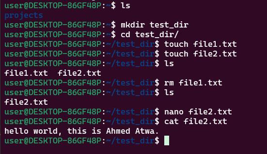

# Linux Basics

## Screenshot



## Commands

1- Create a new folder

```bash
mkdir test_dir
```

2- Change the directory to the new folder

```bash
cd test_dir
```

3- Create a new file

```bash
touch file1.txt
```

4- Create another file

```bash
touch file2.txt
```

5- List the files in the folder

```bash
ls
```

6- Delete the first file

```bash
rm file1.txt
```

7- List the files in the folder

```bash
ls
```

8- Edit the second file

```bash
nano file2.txt
```

9- Display the content of the second file

```bash
cat file2.txt
```