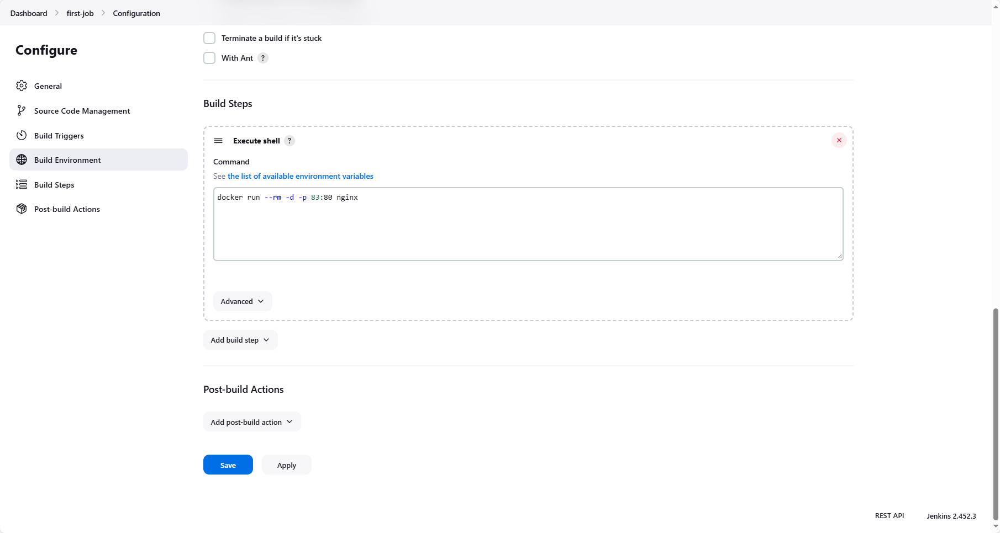

# Jenkins first job

Creating a Jenkins job to run an nginx container.

## Jenkins job

1. Create a new Jenkins job.
2. Add a new build step to execute shell commands.
3. Add the following commands:

```bash
docker run --rm -d -p 83:80 nginx
```

4. Save the job and build it.

## Screenshot

