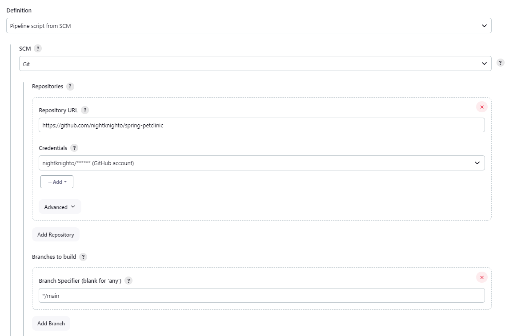
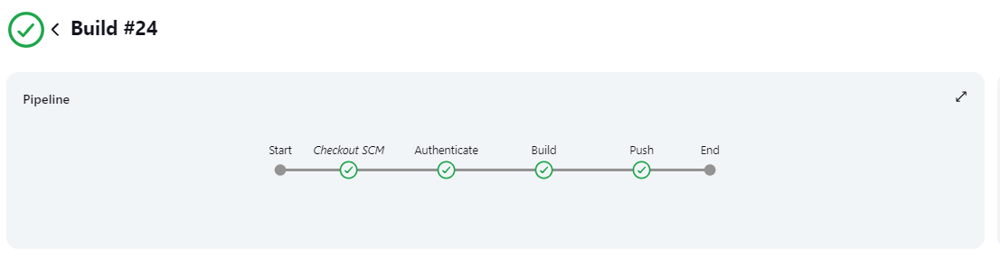

# Jenkins Pipeline

Creating a Jenkins pipeline to build and deploy Spring petclinic app.

## Jenkins pipeline

1. Create a new Jenkins pipeline.
2. Check `Poll SCM` and add the following schedule: `H * * * *` to poll every hour and trigger on changes.
3. In Pipeline definition, select `Pipeline script from SCM`, add the repository URL, set your credentials and set the script path to `Jenkinsfile`.



4. Ensure that the Jenkinsfile is in the root of the repository.
5. Save the pipeline and run it.

## Jenkinsfile

```groovy
pipeline {
    agent any

    stages {
        // This stage is automatic since we are using Jenkinsfile from SCM
        // stage('Checkout') {
        //     steps {
        //         git branch: 'main', credentialsId: '5048ac3b-d10b-4e12-87c3-23b1f531f326', url: 'https://github.com/nightknighto/spring-petclinic'
        //     }
        // }
        stage('Authenticate') {
            steps {
                withCredentials([usernamePassword(credentialsId: '7313fbea-99bb-4679-aa07-6a877c716e3b', passwordVariable: 'PASSWORD', usernameVariable: 'USERNAME')]) {
                    sh '''
                    echo $PASSWORD | docker login -u $USERNAME --password-stdin
                    '''
                }
            }
        }
        stage('Build') {
            steps {
                sh '''
                docker build -t nightknighto/spring-petclinic:jenkins-${BUILD_ID} . -f Dockerfile-multi
                '''
            }
        }
        stage('Push') {
            steps {
                sh '''
                docker push nightknighto/spring-petclinic:jenkins-${BUILD_ID}
                '''
            }
        }
    }
}
```

The pipeline has three stages:

1. **Authenticate**: Authenticate to Docker Hub.
2. **Build**: Build the Docker image.
3. **Push**: Push the Docker image to Docker Hub.


