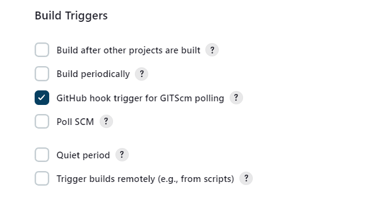
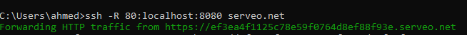
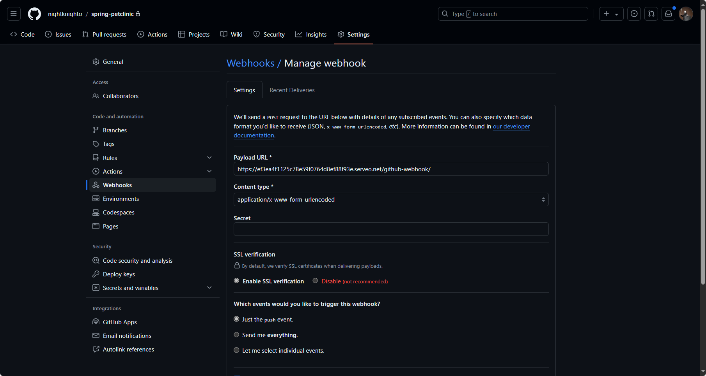

# Jenkins GitHub Webhook

Triggering the previous Jenkins Pipeline job using a github webhook. Github will send a POST request to our local Jenkins server whenever a push event occurs.

## Steps

1. In Jenkings pipeline configuration, check `GitHub hook trigger for GITScm polling` under `Build Triggers`.



2. Now we need a way to expose our local Jenkins server to the internet. We will use serveo.net to create a tunnel to our local server.

```bash
ssh -R 80:localhost:8080 serveo.net
```

This command will return a URL that will forward requests to our local server. We can now use this URL to create a webhook in our Github repository.



> Replace `localhost:8080` with the appropriate address and port of your Jenkins server on your local machine.

> Source: https://stackoverflow.com/questions/45566623/github-webhook-on-local-jenkins-server

3. In Github, go to the repository settings, then to `Webhooks`, and click on `Add webhook`.

4. Add the URL from serveo.net to the `Payload URL` field and append `/github-webhook/` to the URL. Example: `http://your-url.serveo.net/github-webhook/`. Save.



5. Now, whenever a push event occurs in the repository, Github will send a POST request to our local Jenkins server, triggering the pipeline job.