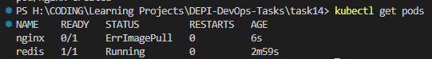
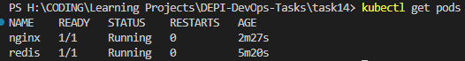

# Kubernetes Lab 1

Lab 1 PDF: [Kubernetes Lab 1](lab1.pdf)


### 1-  Install k8s cluster (minikube)

``` minikube start ```

### 2- Create a pod with the name redis and with the image redis.

``` kubectl run redis --image=redis ```

### 3- Create a pod with the name nginx and with the image “nginx123”. Use a pod-definition YAML file.

```yaml
apiVersion: v1
kind: Pod
metadata:
    name: nginx
    labels:
        name: nginx
spec:
    containers:
    - name: nginx
        image: nginx123
```

```kuebctl apply -f nginx-pod.yaml```

### 4- What is the nginx pod status?

```kubectl get pods```



Status is ErrImagePull

### 5- Change the nginx pod image to “nginx” check the status again.

Change the image in the pod definition file and apply it again.

```yaml
apiVersion: v1
kind: Pod
metadata:
    name: nginx
    labels:
        name: nginx
spec:
    containers:
    - name: nginx
        image: nginx
```

```kubectl apply -f nginx-pod.yaml```

```kubectl get pods```



### 6- How many ReplicaSets exist on the system?

```kubectl get rs```


There are 0 ReplicaSets.

### 7- create a ReplicaSet with name=replica-set-1 image=busybox replicas=3

```yaml
apiVersion: apps/v1
kind: ReplicaSet
metadata:
    name: replica-set-1
spec:
    replicas: 3
    selector:
        app: replica-set-1
    template:
        metadata:
            name: replica-set-1
            labels:
                app: replica-set-1
        spec:
            containers:
                - name: replica-set-1
                    image: busybox
```

```kubectl apply -f busybox-rs.yaml```

### 8- Scale the ReplicaSet replica-set-1 to 5 PODs.

```kubectl scale -f busybox-rs.yaml --replicas=5```

### 9- How many PODs are READY in the replica-set-1?

```kubectl get pods```

There are 5 pods.

### 10- Delete any one of the 5 PODs then check How many PODs exist now? Why are there still 5 PODs, even after you deleted one?

```kubectl delete pod/replica-set-1-4n7n5```

```kubectl get pods```

There are still 5 pods because the ReplicaSet is managing the pods and it will create a new pod if one is deleted.

### 11- How many Deployments and ReplicaSets exist on the system?

```kubectl get deployments```

```kubectl get rs```

There are 0 Deployments and 1 ReplicaSet.

### 12- create a Deployment with name=deployment-1 image=busybox replicas=3

```yaml
apiVersion: apps/v1
kind: Deployment
metadata:
    name: deployment-1
spec:
    replicas: 3
    selector:
        matchLabels:
            app: deployment-1
    template:
        metadata:
            labels:
                app: deployment-1
        spec:
            containers:
            - name: deployment-1
                image: busybox
```

```kubectl apply -f busybox-dp.yaml```

### 13- How many Deployments and ReplicaSets exist on the system now?

```kubectl get all```

There is 1 Deployment and 1 ReplicaSet.

### 14- How many pods are ready with the deployment-1?

```kubectl get pods```

There are 3 pods.

### 15- Update deployment-1 image to nginx then check the ready pods again.

```kubectl set image -f .\busybox-dp.yml deployment-1=nginx```

```kubectl get pods```

There are 3 pods.

### 16- Run kubectl describe deployment deployment-1 and check events. What is the deployment strategy used to upgrade the deployment-1?

```kubectl describe -f busybox-dp.yaml```


The deployment strategy used is RollingUpdate.

### 17- Rollback the deployment-1. What is the used image with the deployment-1?

```kubectl rollout undo -f .\busybox-dp.yml```

```kubectl describe -f busybox-dp.yaml```

The used image is busybox.

### 18- Create a deployment using nginx image with latest tag only and remember to mention tag i.e nginx:latest and name it as nginx-deployment. App labels should be app: nginx-app and type: front-end. The container should be named as nginx-container; also make sure replica counts are 3

```yaml
apiVersion: apps/v1
kind: Deployment
metadata:
    name: nginx-deployment
spec:
    replicas: 3
    selector:
        matchLabels:
            app: nginx-app
            type: front-end
    template:
        metadata:
            labels:
                app: nginx-app
                type: front-end
        spec:
            containers:
            - name: nginx-container
                image: nginx:latest
```

```kubectl apply -f nginx-dp.yaml```
