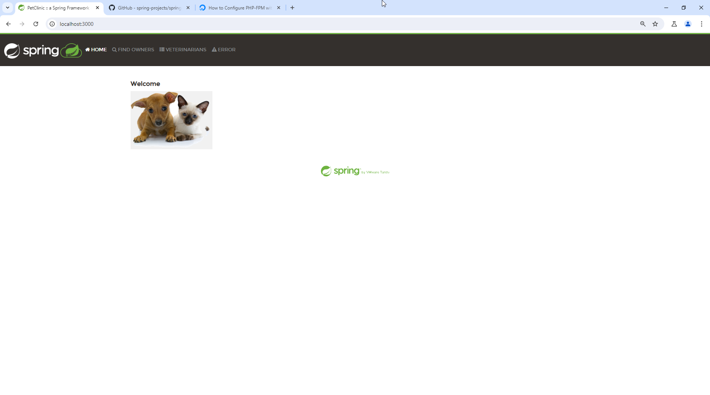

# Nginx Advanced & Docker basics

## Nginx Advanced

### Steps

1. Install nginx 

```bash
sudo apt update
sudo apt install nginx
```

2. Install php7.3, php7.3-fpm, common php7.3 modules 

```bash
sudo add-apt-repository ppa:ondrej/php
sudo apt update
sudo apt install php7.3 php7.3-fpm php7.3-common php7.3-mysql php7.3-gmp php7.3-curl php7.3-intl php7.3-mbstring php7.3-xmlrpc php7.3-gd php7.3-xml php7.3-cli php7.3-zip
```

3. Create info.php file inside /var/www/html with the content:

```php
<?php phpinfo(); ?>
```

4. Create virtual host on nginx pointing to `/var/www/html`
5. Give the server inside nginx name of mobadra.com
6. Make the nginx listen to php-fpm on port 9000

Path: `/etc/nginx/conf.d/mobadra.conf`

```nginx
server {
    listen 9000;
    listen [::]:9000;
    server_name mobadra.com www.mobadra.com;
    root /var/www/html/mobadra.com;

    location ~ \.php$ {
        fastcgi_split_path_info ^(.+\.php)(/.+)$;
        fastcgi_pass unix:/run/php/php7.3-fpm.sock;
        fastcgi_index index.php;
        include fastcgi.conf;
    }
}
```

7. Add static folder under the root /var/www/mobadra.com/html and upload images on this folder 
8. Create static location inside server nginx mobadra.com/static/image1.png

Path: `/etc/nginx/conf.d/mobadra.conf`

```nginx
server {
    ...

    location / {
        try_files $uri $uri/ /index.php$is_args$args;
    }

    ...
}
```

9. Make sure the images are gzipped <-- from headers you will see gzip in the Content-Encoding: gzip 

```nginx
server {
    ...

    gzip on;

    gzip_vary on;
    gzip_proxied any;
    gzip_comp_level 6;
    gzip_buffers 16 8k;
    gzip_http_version 1.1;
    gzip_types text/plain text/css application/json application/javascript text/xml application/xml application/xml+rss text/javascript image/png;

    ...
}
```

10. Cache server

```nginx
server {
    ...

    proxy_cache mycache;
    proxy_cache_min_uses 1;
    proxy_ignore_headers X-Accel-Expires Expires Cache-Control Set-Cookie; 
    proxy_cache_valid 200 302 60h;
    proxy_cache_valid any 60m;

    ...
}
```

### final nginx configuration file

[nginx configuration file](nginx-task/mobadra.conf)

## Docker basics

1. install docker

```bash
sudo snap install docker
```

2. create a container with openjdk:17-jdk image

```bash
docker run -p 3000:8080 --name spring_container -it openjdk:17-jdk bash
```

3. Manually install spring-petclinic application inside

```bash
docker exec -it spring_container bash

apt-get update
git clone https://github.com/spring-projects/spring-petclinic
cd spring-petclinic
./mvnw package
java -jar target/*.jar
```

### Screenshot

