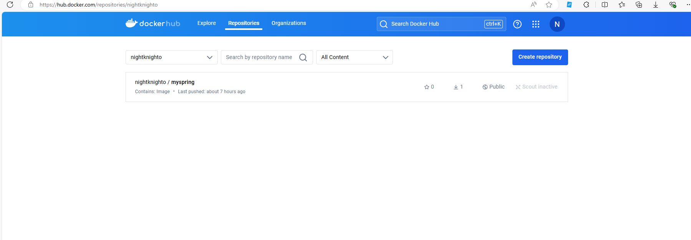
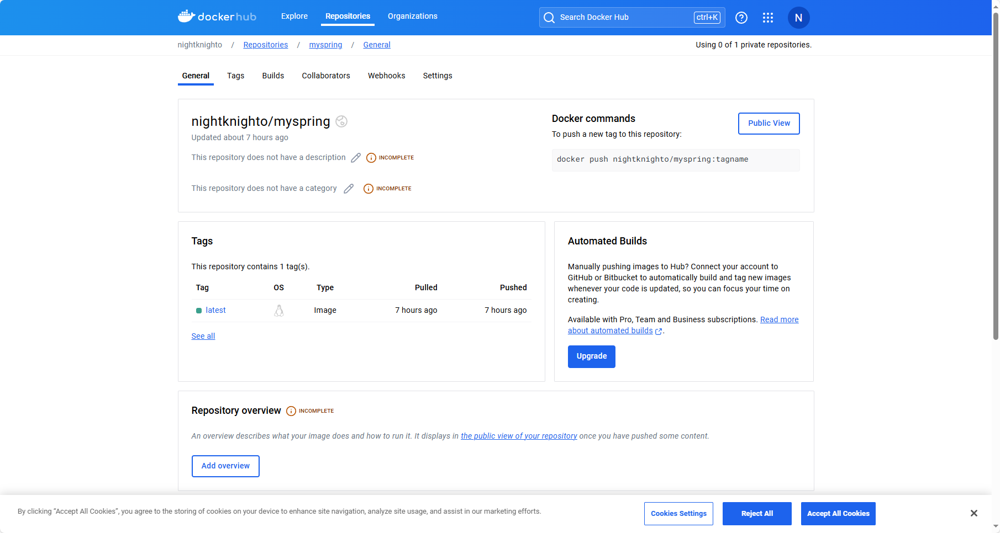

# More on Docker and Dockerhub

Using the same container from the previous task with spring-petclinic application installed, with the name `spring_container`.

1. Commit the container to a new image called `myspring`:

```bash
docker commit -c "CMD java -jar /var/app/spring-petclinic/target/*.jar" spring_container myspring:latest
```

> The `-c` flag is used to set the default command to run when the container starts. In this case, it will run the spring-petclinic application.

2. Tag the image with your Dockerhub username:

```bash
docker tag myspring nightknighto/myspring
```

3. Save the image to a tar file:

```bash
docker save nightknighto/myspring -o images.tar
```

4. Push the image to Dockerhub:

```bash
docker login
```

5. Enter your Dockerhub credentials.

```bash
docker push nightknighto/myspring
```

## Screenshot


